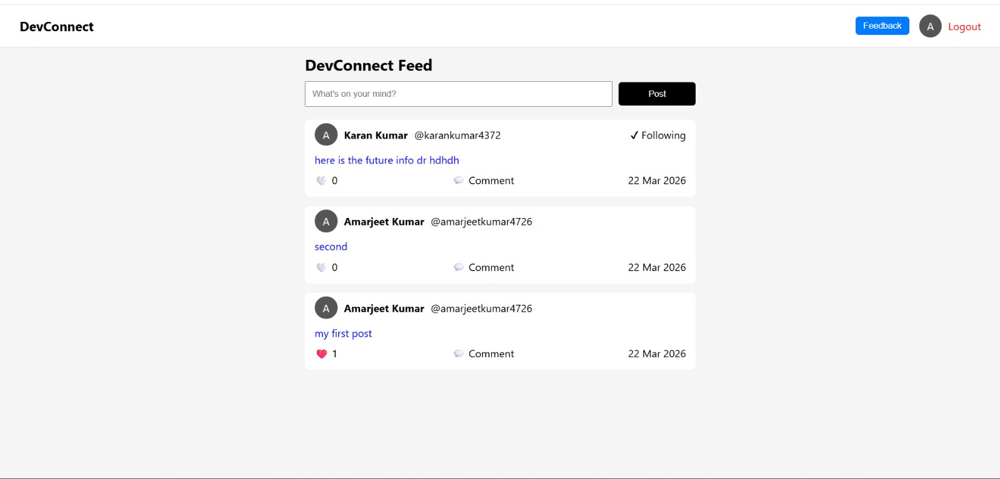

# 🚀 DevConnect - Developer Social Platform

## 📌 About Project

**DevConnect** is a social networking platform designed for developers to connect, share ideas, and interact with each other.

It allows users to create posts, follow other developers, and engage through likes and comments — similar to a mini LinkedIn for developers.

---

## 🧑‍💻 Tech Stack

- React JS
- Node JS
- Express JS
- MongoDB
- JavaScript, HTML, CSS

---

## ✨ Features

- 🔐 User Authentication (Register / Login)
- 📝 Create, Update, Delete Posts
- ❤️ Like / Dislike Posts
- 💬 Comment on Posts
- 👥 Follow / Unfollow Users
- 📰 Personalized Feed

---

## 🖼️ Preview

---

## 🚀 Future Plans / Enhancements

- 📱 Make the application fully responsive (mobile-friendly)
- 🔔 Add real-time notifications
- 💬 Implement real-time chat between users
- 👤 Add user profile customization (bio, profile picture, cover image)
- 📷 Image upload in posts
- 🔍 Search functionality (users & posts)
- 🌙 Dark mode support
- ⚡ Improve performance & optimize API calls
- 🛡️ Add better security (JWT refresh tokens, validations)

---

## 👨‍💻 Developer

**Amarjeet Kumar**  
MERN / MEAN Stack Developer

---

## 🔗 Connect with Me

- LinkedIn: https://linkedin.com/in/amarjeet-kumar-46b79b236  
- Instagram: https://instagram.com/amarkumar.aaryan.5  
- Email: ak123del@gmail.com  

---

## ⭐ Support

If you like this project, give it a ⭐ on GitHub!